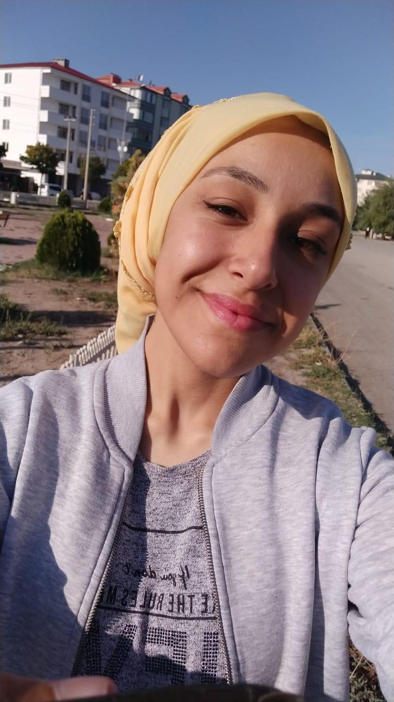

# İyi Kalpler Topluluğu 👨‍👩‍👧‍👦❤️

**Hakkimizda:**

İyi Kalpler Topluluğu, Kar Amacı Gütmeyen Kuruluş
Dünyada ve Türkiye'deki DS çocuklar ile ilgili güncel gelişmeleri çok yakından takip eden, Down sendromunu duyurmak, toplumsal farkındalığı yükseltmek için sürekli çalışan, ülke genelinde özel çocukların oyuncak ihtiyacınıve böylece tüm bağışçılarla işbirliği içinde çalışmayı amaçlayan bir misyon üstlenen, yani esas olarak toplumun engellilik algısını kaldırark Down Sendromlu bireylerin bebeklikten itibaren her yaşta ve konumda oyuncak ıhtıyacını karşılayarak, fırsat eşitliği sağlamayı ve toplumdaki vazgeçilmez yerlerini sağlamlaştırmayı amaçlayan bir projedir.

Merhabalar, Ben Cennet Tuğba Uzdilli Iğdır Universitese Bilgisayar programcılığı 1.Sınıf Öğrencisiyim.

Tutkulu bir yazılım mühendisi olma yolunda bilgilerimi Down Sendromlu Çocuklar için Sosyal Yardım Projeleri geliştirerek destek olmaya çalışıyorum.

Desteklerinizi bekliyorum.